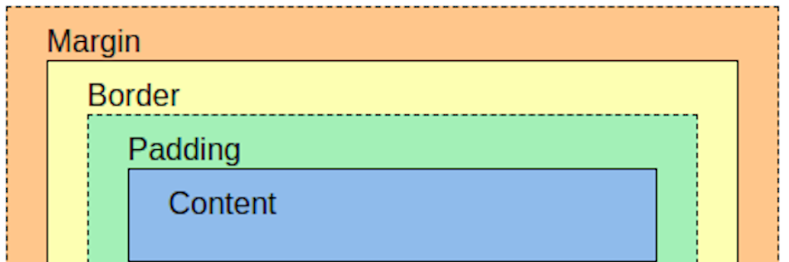

I have a love-hate relationship with Cascading Style Sheets (CSS). I love the power and flexibility of CSS, but I hate the arcane rules that govern it. I love CSS Frameworks like Bootstrap, but hate that they do not simplify those arcane rules. As a
back-end developer used to fighting with databases and servers, CSS is wizardry to me of a type that I am not used to casting.

## The Good

The good thing about CSS is the basics are easy to learn and apply. The syntax, box model, and cascade are easy to understand. The browser developer tools are great for debugging and experimenting with CSS. Once you have the basics down, adding a CSS
Framework like Bootstrap makes it easy to create simple responsive websites.

## The Bad

The bad thing about CSS is that it is easy to get lost in the cascade, which is a double-edged sword. It is great for applying styles to elements, but you can easily apply styles to elements that you did not intend or override styles that you did not
intend. A CSS Framework like Bootstrap can help with this, but you still have to be careful.

## The Ugly

The ugly thing about CSS is that there are deeply embedded rules about what properties can be applied to different elements based on their display property. For example, you cannot apply a margin to an inline element. You have to change the display
property to block or inline-block. This is not intuitive and can be frustrating when you are trying to get a page to look just right.

## The Beautiful

The beautiful thing about CSS is there is almost no effect that you cannot achieve when you are creating your page. You can create beautiful pages that are responsive and look great on any device. This is where CSS Frameworks like Bootstrap really
shine. The developers of Bootstrap have already done the hard work of figuring out the CSS for you. You just have to apply the classes to your elements.