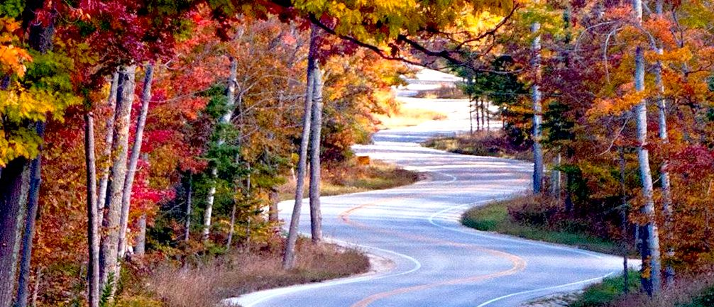

## Love at First Byte

When I was in my tweens, my friends starting getting the first personal computers: Atari, Commodore, Apple, etc. We taught each other how to program, mostly D&D Character generators. At the same time, my Dad was staying late at the Navy to play on  
the computers there. When the first IBM Clones came out, my mom forced him to buy one. Since he didn't get home until dinner time, the computer was mine all afternoon. I fell in love with the software and the hardware; gone were the dreams of
becoming a chef. By the time we got to High School, my friends and I were teaching the teacher in the only computer class.

## On the Road

When I went to college, the first time, I was going to be a Mechanical Engineer and design robots. But alas, that was not to be as I was invited to consider other majors due to my performance in class. So, I was relegated to community college, where
I toyed with being an English major, an Art major, and a couple of others. I finally settled on Industrial Design, as something creative, but not Engineering. Off to Arizona State University I went, were after one semester I ran out of Financial Aid.
I was already working as a programmer, so I kept at it. But I promised myself I was not going to be a programmer for the rest of my life.

## Forks in the Road

The turning point for me was when I got to design and implement a new system from scratch. I wasn't just coding to specifications written by someone else. It was creative. I had a *Eureka!* moment that this is what I wanted to do with my life. So I
kept at it, moving up the ranks, changing jobs when necessary, and I had found by bliss. I promised myself I would get my Bachelor's degree someday.

## *Eureka!*

So, here I am at University of Hawaii at Manoa, taking upper level classes after a brief stint at Leeward Community College to get my prerequisites out of the way. I hope to learn more about Artificial Intelligence and Machine Learning. I'd like to
research giving AI a subconscious stream of thought so that it can have *Eureka!* moments when seemingly unrelated items are brought into memory at the same time.
