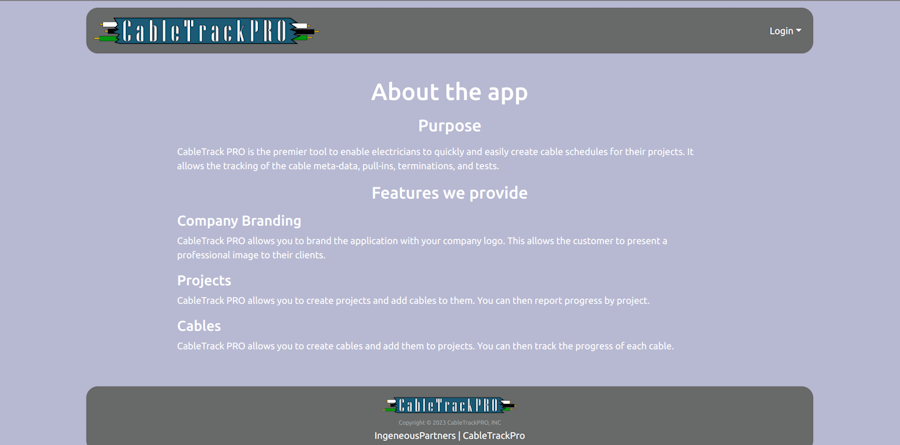
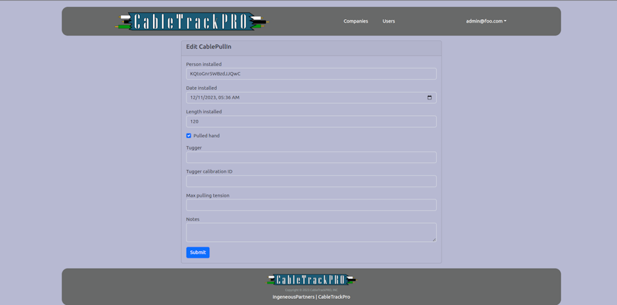

# An App by  [Ingenious Partners](https://ingeniouspartners.github.io)

[CableTrack PRO](https://app.cabletrack.pro) is the premier application allowing Electricians to manage all of the meta-data about the cables and wires they install on a project. CEOs, Project Managers, and Electricians will finally be on the same
page as to the status of the electrical build. No more slips and scraps of paper with illegible handwriting that get lost or misplaced. Project Managers will be able to accurately pull completion data and accurately prepare bills.

[CableTrack PRO](https://app.cabletrack.pro) utilizes granular permissions to authorize users to perform actions and view forms. The navigation is instrumented so that the user only sees the links they can reach.

[CableTrack PRO](https://app.cabletrack.pro) is constructed on the foundational technologies of Node.js, React.js, BootStrap.js, Meteor, and MongoDB. Javascript was employed for both the back-end and front-end development of the application, while
HTML and CSS were utilized to construct the user interface.

There is still a lot of work to do, as Terminations and various tests need to be added. The navigation needs to be optimized and refactored. Also, fields for selecting a user need to be made as combo boxes, allowing the user to select by name yet
save the ID to the database.

As the person with the domain knowledge regarding the necessary meta data electricians need to track when installing cables, I lead the development effort. Keeping the team on track was a matter of communication, which was made easier using
[Issue Driven Project Management (IDPM)](https://courses.ics.hawaii.edu/ics314f23/morea/project-management/reading-guidelines-idpm.html). 

I learned a ton more about JavaScript than I knew, and was able to update my understanding of how Javascript works. Before taking ICS 314 Software Engineering at UH Manoa, I had only heard of Node.js, React.js and BootStrap.js so it was a real treat
to get to use these technologies. Meteor and MongoDB were completely unknown to me and I enjoyed exploring them.

Source: [ingeniouspartners/cabletrack.pro](https://github.com/ingeniouspartners/cabletrack.pro)
