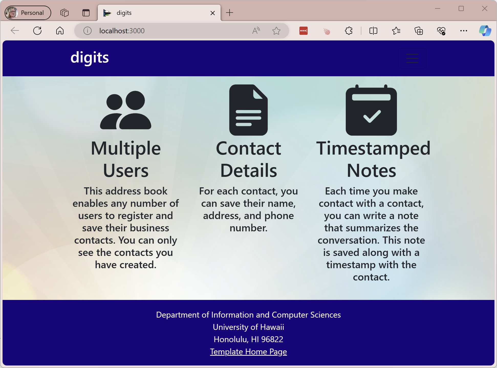

**Digits** is an app that I built as classwork in *ICS 314 Software Engineering I* to track contacts. It is a simple app that allows you to add, edit, and delete contacts. It also allows you to add, edit, and delete notes about the contacts.

**Digits** is built using Node.js, React.js, BootStrap.js, Meteor and MongoDB. Javascript was used on the back and front-end to develop the application. HTML and CSS were used to build the user
interface.

This was a fun project, as we slowly transformed the app from the initial version to the final version. We started with the [Meteor Application Template React](https://github.com/ics-software-engineering/meteor-application-template-react), which is a
generic app about managing stuff, and created a full-fledged, multi-user app.

Source: [awjans/digits](https://github.com/awjans/digits)
