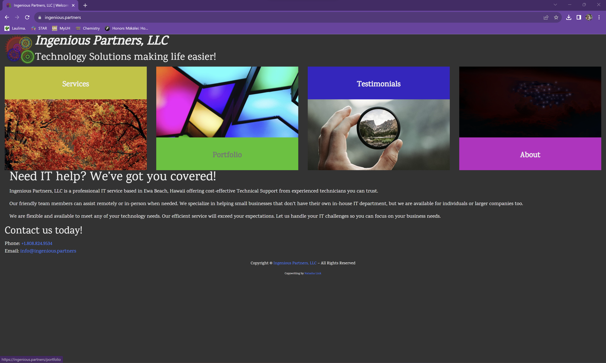

[Ingenious Partners, LLC](https://ingenious.partners) is a website that I built for my own company. I created the company as an IT Services provider and an incubator for the projects I am planning. The project helped me learn how to design and
implement a responsive website.

[Ingenious Partners, LLC](https://ingenious.partners) is implemented using [Laravel](https://laravel.com/), a PHP application platform. I found it useful for it's templating engine and planned to leverage the internationalization features.
In this project I gained experience with front-end website design and associated technologies.

Source: [awjans/ingenious](https://github.com/awjans/ingenious)
