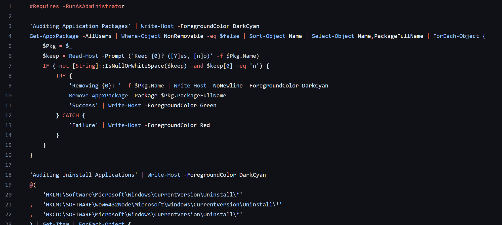

After getting tired of the commercial performance tuning software wanting money to do the best job, I decided to put what I knew and suggestions from the internet into a PowerShell script that would do at least the basics. The trickiest part of the whole endeavor was getting the PowerShell to run elevated without having to start the PowerShell runtime as elevated first.

Source: <a href="https://github.com/awjans/PerfTune">awjans/PerfTune</a>
